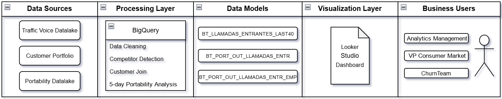
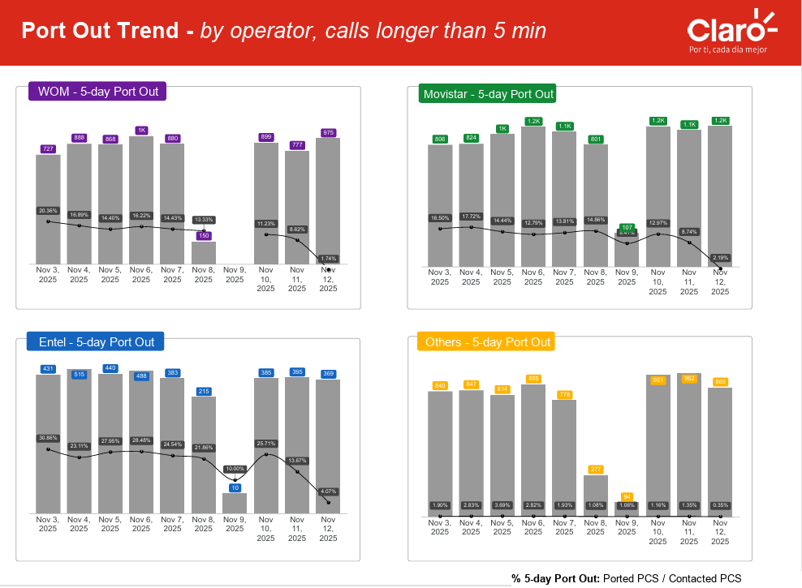
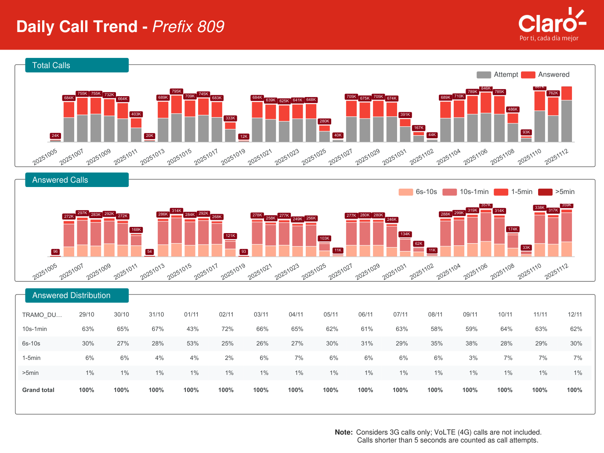

# Competitor Contact & Churn Impact Analytics

End-to-end BigQuery pipeline that monitors incoming calls from competitors, analyses customer behaviour after the contact, and measures **portability (churn) risk over a 5-day horizon**.

The project was developed within the Churn & Business Analytics team of **Claro Chile** (telecommunications), delivering daily insights to management and to the VP of the Personas (consumer) market.

> **Language note:** the figures in this README have English titles and labels. The original PDF report (`reporte_llamados.pdf`), the SQL column names and the table names are in Spanish, the business language of the original deliverable; the rest is documented in English.

## Contents

- [Business context](#business-context)
- [Objective](#objective)
- [Data pipeline architecture](#data-pipeline-architecture)
- [Naming convention used in the diagram](#naming-convention-used-in-the-diagram)
- [Data flow and operations](#data-flow-and-operations)
- [Business impact](#business-impact)
- [Operational KPIs](#operational-kpis)
- [Repository structure](#repository-structure)
- [Output / final report](#output--final-report)
- [Tech stack](#tech-stack)

## Business context

In the telecommunications industry, competitors run direct-contact campaigns, calling customers by phone to induce **portability** (the customer leaves and keeps their number).

The Churn Analytics team needed to monitor this behaviour **daily**: identify when a customer was contacted from numbers associated with competitors, and evaluate how those contacts affected the probability of porting out in the following days.

Before this work there was no automated system able to:

- identify and segment incoming calls coming from competitor operators,
- link those interactions to the active customer base,
- measure the impact of those calls on portability within a 5-day window.

## Objective

Design and automate a BigQuery data pipeline that identifies, processes and analyses incoming calls from competitor operators and links them to the company's customer base. The system makes it possible to:

- detect, every day, the customers contacted by competitors,
- enrich call data with customer information (customer ID, segment, status),
- measure port-out behaviour in the 5 days after the contact,
- analyse the time impact of those calls on port-out probability,
- segment results by call duration and originating operator,
- deliver automated daily reports for management and senior leadership.

## Data pipeline architecture

The system was built on Google Cloud Platform, with BigQuery as the main processing engine.

<p align="center">
  
</p>

The pipeline integrates several data sources from the company and from the telecom ecosystem, enabling an automated flow of call and portability analysis.

## Naming convention used in the diagram

To improve readability, the diagram uses simplified table names. They map directly to the real tables implemented in BigQuery:

| Name in the diagram | Real BigQuery table |
|--------------------|------------------------|
| BT_LLAMADAS_ENTRANTES_LAST40 | BT_LLAMADAS_ENTRANTES_ULT40_DIAS_V4 |
| BT_PORT_OUT_LLAMADAS_ENTR | BT_PORT_OUT_LLAMADAS_ENTR_V4 |
| BT_PORT_OUT_LLAMADAS_ENTR_EMP | BT_PORT_OUT_LLAMADAS_ENTR_EMPRESAS_V4 |

The simplification is only visual and does not change the pipeline's structure or logic. Project and dataset identifiers in the SQL files are generic placeholders (`analytics-project-dev`, `datalake-project-dev`).

## Data flow and operations

### 1. Data sources

- **Voice traffic data (incoming-call data lake):** call records with origin number, destination number, duration and event date.
- **Customer portfolio (postpaid base):** active customers with customer ID, status and segment.
- **Industry portability dataset:** industry-wide portability records, used to detect operator changes over time.

### 2. Data processing (BigQuery)

A BigQuery transformation pipeline that includes:

- normalisation of incoming call traffic,
- identification of competitor calls through prefix rules,
- enrichment with the active customer portfolio,
- construction of the 5-day churn analysis window,
- aggregation of metrics by segment, call duration and operator.

### 3. Data models generated

Three main tables:

- **BT_LLAMADAS_ENTRANTES_LAST40:** base dataset of incoming calls enriched with customer information.
- **BT_PORT_OUT_LLAMADAS_ENTR:** aggregated port-out metrics within 5 days after the contact.
- **BT_PORT_OUT_LLAMADAS_ENTR_EMP:** analysis segmented by originating operator and call duration.

### 4. Data visualisation

The processed data feeds Looker Studio dashboards that allow:

- daily monitoring of competitor calls,
- follow-up of port-out rates,
- segmentation by operator and call duration,
- executive-level views for management and the VP.

### 5. Automation

The pipeline runs daily through scheduled BigQuery queries, keeping the indicators used by the business constantly up to date.

## Business impact

The pipeline moved churn analysis from a *reactive* approach to a system based on **competitor-contact events**. It identifies 100% of high-risk calls (longer than 5 minutes), which represent about 1% of all answered calls.

This high-risk segment showed a port-out probability **4x to 6x higher** than shorter calls, and became the main operational indicator to prioritise customers at risk.

<p align="center">
  
</p>

On top of this system, an **early-activation retention strategy** was implemented: about 600 high-risk customers are contacted every day, concentrating the effort on the segment with the highest churn probability (competitor contact > 5 minutes plus operator segmentation rules).

This approach systematically prioritises the critical universe, which is close to 1% of the answered calls processed by the pipeline.

## Operational KPIs

- ~700k total calls processed per day
- ~300k answered calls (~40% answer rate)
- ~1% of answered calls belong to the high-risk segment (> 5 min)
- High-risk segment with 4x - 6x higher churn probability
- 100% of high-risk events detected by the pipeline
- ~600 customers contacted daily through automated retention campaigns
- Estimated churn reduction of 35% - 45% in the intervened segment
- Estimated effective retention rate of 7% - 9% in the intervention universe

> **Reading note:** port-out % is measured at 5 days (ported numbers / contacted numbers). The last 5 days of the report still have an open window, so their rates look artificially low (for example the latest days for Entel and WOM in `Insight_portout.PNG`) and should be read as immature data.

## Repository structure

```text
├── assets/
│   └── diagrams/
│       └── architecture.PNG
│
├── outputs/
│   ├── Insight_portout.PNG
│   ├── dashboard_preview.png
│   └── reporte_llamados.pdf
│
├── sql/
│   ├── 01_base_call_enrichment.sql
│   ├── 02_churn_5day_metrics.sql
│   └── 03_churn_segmentation_analysis.sql
│
└── README.md
```

## Output / final report

The pipeline produces a PDF report with the main results of the competitor-call analysis and its relation to churn. A preview of the dashboard page used for executive consumption:

<p align="center">
  
</p>

Download the report: **[reporte_llamados.pdf](outputs/reporte_llamados.pdf)** (in Spanish)

## Tech stack

- Google Cloud Platform (GCP)
- BigQuery
- SQL (window functions, CTEs, joins)
- Looker Studio
- Data pipelines / scheduled queries
